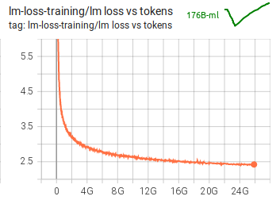
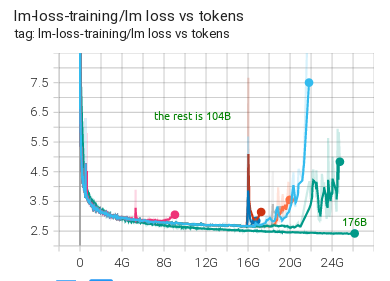
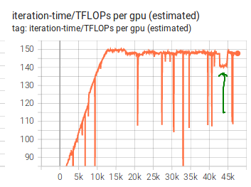

# The final training

Trials and tribulations during the 176B 250k multi-lingual training.

For the trials and tribulation during the preparation stage before the launch  see: [chronicles-prequel](chronicles-prequel.md).

The full spec is [here](README.md) and the script is [here](tr11-176B-ml.slurm).

## main


### 2022-03-11

Launch

The training launched on March 11, 2022 11:42am PST


### 2022-03-14

Switched from MBS=1 to MBS=2 at GBS=784, as now there is enough microbatches in each of the 8 replicas to fill each pipeline 4 times. With MBS=2 each replica has `784/(2*8) = 49` microbatches over 12 PP stages which is already pretty efficient. (`GBS/(MBS*DP)`)


### 2022-03-18

7 days after the launch the training finished the batch size ramp up stage and we are now at full throttle of GBS=2048 and at 149-150 TFLOPs per GPU.

A single train iteration is about 105 secs.

A single eval iteration is about 12 min (1 iteration eval on each of 29 datasets) - we perform it once every 1k iteration and it "costs" about 7 iterations or 0.7% of training.

A checkpoint is saved in 40 secs, which is about 1/2 iteration duration.

We consumed 20B/450B tokens.

At the current speed and no downtime we need 125 days more `(115311-12695)*105/(3600*24)=124.7` to finish the plan.

the math is based on the recent log:

```
 [default7]: iteration    12695/  115311 | consumed samples:      9841584 | consumed tokens:  20155564032 | elapsed time per iteration (s): 105.22 | learning rate: 5.969E-05 | global batch size:  2048 | lm loss: 2.463556E+00 | grad norm: 0.174 | num zeros: 0.0 | number of skipped iterations:   0 | number of nan iterations:   0 | samples per second: 19.463 | TFLOPs: 149.02 |
```


### What makes the 176B-ml training so stable?

To compare: at [104B-en experiments](https://huggingface.co/bigscience/tr8b-104B-logs/tensorboard?tab=scalars&runSelectionState=eyJ0ZW5zb3Jib2FyZC9iYXNlLWV4cC0xMSI6ZmFsc2UsInRlbnNvcmJvYXJkL2NsLWV4cC0wMSI6ZmFsc2UsInRlbnNvcmJvYXJkL2NsLWV4cC0wMiI6ZmFsc2UsInRlbnNvcmJvYXJkL2JuYi1leHAtMDEiOmZhbHNlLCJ0ZW5zb3Jib2FyZC9ibmItZXhwLTAyIjpmYWxzZSwidGVuc29yYm9hcmQvYm5iLWV4cC0wMyI6ZmFsc2UsInRlbnNvcmJvYXJkL2JuYi1leHAtMDQiOmZhbHNlLCJ0ZW5zb3Jib2FyZC9iYXNlLWV4cC0xMiI6ZmFsc2UsInRlbnNvcmJvYXJkL2JuYiI6ZmFsc2UsInRlbnNvcmJvYXJkL2JuYi1leHAtMDUiOmZhbHNlLCJ0ZW5zb3Jib2FyZC9lbWItbm9ybSI6dHJ1ZSwidGVuc29yYm9hcmQvZW1iLW5vcm0tMDEiOnRydWUsInRlbnNvcmJvYXJkL2VtYi1ub3JtLTAyIjp0cnVlLCJ0ZW5zb3Jib2FyZC9lbWItbm9ybS0wMyI6dHJ1ZSwidGVuc29yYm9hcmQvZW1iLW5vcm0tMDQiOnRydWUsInRlbnNvcmJvYXJkL2VtYi1ub3JtLTA1Ijp0cnVlLCJ0ZW5zb3Jib2FyZC9lbWItbm9ybS0wNiI6dHJ1ZSwidGVuc29yYm9hcmQvY2wiOmZhbHNlLCJ0ZW5zb3Jib2FyZC9jbC1hMTAwIjpmYWxzZX0%253D&tagFilter=loss%2520vs%2520tokens#scalars&runSelectionState=eyJ0ZW5zb3Jib2FyZC9iYXNlLWV4cC0xMSI6dHJ1ZSwidGVuc29yYm9hcmQvY2wtZXhwLTAxIjpmYWxzZSwidGVuc29yYm9hcmQvY2wtZXhwLTAyIjpmYWxzZSwidGVuc29yYm9hcmQvYm5iLWV4cC0wMSI6ZmFsc2UsInRlbnNvcmJvYXJkL2JuYi1leHAtMDIiOmZhbHNlLCJ0ZW5zb3Jib2FyZC9ibmItZXhwLTAzIjpmYWxzZSwidGVuc29yYm9hcmQvYm5iLWV4cC0wNCI6ZmFsc2UsInRlbnNvcmJvYXJkL2Jhc2UtZXhwLTEyIjp0cnVlLCJ0ZW5zb3Jib2FyZC9ibmIiOnRydWUsInRlbnNvcmJvYXJkL2JuYi1leHAtMDUiOnRydWUsInRlbnNvcmJvYXJkL2VtYi1ub3JtIjp0cnVlLCJ0ZW5zb3Jib2FyZC9lbWItbm9ybS0wMSI6dHJ1ZSwidGVuc29yYm9hcmQvZW1iLW5vcm0tMDIiOnRydWUsInRlbnNvcmJvYXJkL2VtYi1ub3JtLTAzIjp0cnVlLCJ0ZW5zb3Jib2FyZC9lbWItbm9ybS0wNCI6dHJ1ZSwidGVuc29yYm9hcmQvZW1iLW5vcm0tMDUiOnRydWUsInRlbnNvcmJvYXJkL2VtYi1ub3JtLTA2Ijp0cnVlLCJ0ZW5zb3Jib2FyZC9jbCI6ZmFsc2UsInRlbnNvcmJvYXJkL2NsLWExMDAiOmZhbHNlfQ%3D%3D&tagFilter=loss%20vs%20tokens) we failed to cross the 24B-tokens barrier. You can find the indepth details in [the 104B chronicles](../tr8b-104B/chronicles.md).


At 176B-ml we have crossed [24B-tokens barrier](https://huggingface.co/bigscience/tr11-176B-ml-logs/tensorboard?tab=scalars&tagFilter=loss%2520vs%2520tokens) w/o a single instability issue:



Here is an overlapping image:



It's hard to tell if there is one specific improvement that made the biggest impact w/o doing ablation studies, which would be both expensive and time consuming.

It's probably a combination of a few or all of the following improvements:

1. Very clean data
2. BF16 mixed precision regime
3. FP32 grad accumulation for the pipeline
4. A very low standard initialization `sqrt(0.3333/NHIDDEN)` - in 104B-en used `sqrt(0.4/NHIDDEN)`
5. Word embedding layer norm - but it was also used in 104B-en

If you believe in metaphysics perhaps one more important factor is the "intentional" contribution of many thousands of ML enthusiasts around the world who want this largest open source multilingual language model training to succeed.


### 2022-03-21

One of the GPUs crashed at 2022-03-21_13:34:34 JZ time:

```
[default3]:terminate called after throwing an instance of 'c10::CUDAError'
[default3]:  what():  CUDA error: unknown error
[default3]:Exception raised from query at ../aten/src/ATen/cuda/CUDAEvent.h:95 (most recent call first):
[default3]:frame #0: c10::Error::Error(c10::SourceLocation, std::string) + 0x42 (0x1518a06137d2 in /gpfswork/rech/six/commun/conda/tr11-176B-ml/lib/python3.8/site-packages/torch/lib/libc10.so)
[default3]:frame #1: c10d::ProcessGroupNCCL::WorkNCCL::finishedGPUExecutionInternal() const + 0x11a (0x15190c6c29ea in /gpfswork/rech/six/commun/conda/tr11-176B-ml/lib/python3.8/site-packages/torch/lib/libtorch_cuda_cpp.so)
[default3]:frame #2: c10d::ProcessGroupNCCL::WorkNCCL::isCompleted() + 0x50 (0x15190c6c4fd0 in /gpfswork/rech/six/commun/conda/tr11-176B-ml/lib/python3.8/site-packages/torch/lib/libtorch_cuda_cpp.so)
[default3]:frame #3: c10d::ProcessGroupNCCL::workCleanupLoop() + 0x145 (0x15190c6c6265 in /gpfswork/rech/six/commun/conda/tr11-176B-ml/lib/python3.8/site-packages/torch/lib/libtorch_cuda_cpp.so)
[default3]:frame #4: <unknown function> + 0xc2ba3 (0x15191b339ba3 in /lib64/libstdc++.so.6)
[default3]:frame #5: <unknown function> + 0x814a (0x15191c77d14a in /lib64/libpthread.so.0)
[default3]:frame #6: clone + 0x43 (0x15191c4acdc3 in /lib64/libc.so.6)
```

we lost 7.3h of work, it failed 2 iterations before checkpoint saving time :(

Will switch to more frequent checkpoint saving of 200 iterations and will lower it further if the hardware failures continue. With 2.3TB checkpoint size and 40 secs to save a checkpoint we don't want to do it too often.


### 2022-03-22

Switched to `SAVE_INTERVAL=100` as JeanZay had some emergency maintenance downtime and we lost some hours again, so now with 100 iterations per checkpoint we would lose at most 3h.


### 2022-03-24 grad clip TP sync bug fixing

We discovered a bug in BF16Optimizer that didn't clip gradients in TP ranks > 1, leading to layer norm weights and biases getting out of sync. Mathematically they all should have the same layer norm weights since the TP splitting is virtual. This doesn't impact the model while it's training, as each TP rank just learns its own weights. But it will be a problem once the model training has been finished and TP ranks need to be merged from 4 to 1. Since if we use one of them or average the model's correctness will be impacted.

Thomas Wang wrote a test that reproduces the problem with a small test:
`test_layer_norm_consistent` in https://github.com/bigscience-workshop/Megatron-DeepSpeed/pull/271

And the bug in BF16Optimizer was then quickly identified and fixed [here](https://github.com/microsoft/DeepSpeed/pull/1801/commits/e24814a10de04ce280efe2adb027b023e3336493).

Now the challenge is how do we sync the live weights.

As a temporary band-aid Thomas Wang added a code to sync bf16 layer norm weights before each forward:
https://github.com/bigscience-workshop/Megatron-DeepSpeed/pull/272
and we used this temporary work-around for now.

last checkpoint before restart that applied this workaround: global_step17235


### 2022-03-28 Fixing out of sync layer norms

So we developed a new Deepspeed code that allows one to have accessors to the previously inaccessible fp32 and optimizer state discreet entries hidden inside the flattened 1 per param group tensor.

Once this was written it was now possible to sync b16, fp32 layer norm weights on the checkpoint loading, including syncing the optimer states corresponding to layer norm params.
https://github.com/microsoft/DeepSpeed/pull/1801/commits/4e8f7fff9a1575f16191e16d2d161af4e6b52b51

Then the code was written to sync b16, fp32 and optim states for 4 types of layer norm:
https://github.com/bigscience-workshop/Megatron-DeepSpeed/pull/274

last good checkpoint before restart with the sync: global_step20448

Switched to this branch:
https://github.com/bigscience-workshop/Megatron-DeepSpeed/pull/274

Restarted from it, run for 4 iterations, saved the checkpoint

First checkpoint saved after restart: global_step20452

Result 60% of `post_attention_layernorm.weight` are in sync across TP dimension, some layers are not in sync again - some partially - some all of TP ranks.

So one bug in BF16 optimizer was solved and the live model has been fixed, but clearly there is at least one more bug somewhere. And it predates BF16 as I have discovered this same problem in all 104B checkpoints. I didn't find any problems in 13B model.

So for now restarted again from the branch with per iteration bf16 layer norm weight syncing:
https://github.com/bigscience-workshop/Megatron-DeepSpeed/pull/272
so that we don't continue getting out of sync.


### 2022-03-30

At iteration 21680 switched from https://github.com/bigscience-workshop/Megatron-DeepSpeed/pull/272
to a different version of the layer-norm auto-sync band-aid, which performs `all_reduce` with `ReduceOp.AVG` - no manual division by `TP_size=4`, which corrects the gradients back to an identity and not 1/4th. `all_reduce` is not an `AutoGrad` function, but division is.

This version is slightly faster as well as it doesn't clone the tensors.

```
diff --git a/megatron/model/fused_layer_norm.py b/megatron/model/fused_layer_norm.py
index 0ae519a..6305bcd 100644
--- a/megatron/model/fused_layer_norm.py
+++ b/megatron/model/fused_layer_norm.py
@@ -85,6 +85,16 @@ class MixedFusedLayerNorm(torch.nn.Module):


   def forward(self, input):

    torch.distributed.all_reduce(self.weight, op=torch.distributed.ReduceOp.AVG, group=mpu.get_tensor_model_parallel_group())
    torch.distributed.all_reduce(self.bias, op=torch.distributed.ReduceOp.AVG, group=mpu.get_tensor_model_parallel_group())

    return FusedLayerNormAffineFunction.apply(
      input, self.weight, self.bias, self.normalized_shape, self.eps)
```


### 2022-04-04

Switched to deepspeed@olruwase/bf16-updates 5ea1c60f8 (HEAD) - which includes a few minor fixes which don't impact the main training, but are needed if we want to resync weights or dump fp32 weights and optim states.

Saved checkpoint iteration before the switch: 25956


### 2022-04-06

First restarted with https://github.com/bigscience-workshop/Megatron-DeepSpeed/pull/274 to sync layer norm weights and RNG states.

Saved checkpoint iteration before the switch: 26343

Then restarted after adding the RNG sync code: https://github.com/bigscience-workshop/Megatron-DeepSpeed/pull/276. But

Saved checkpoint iteration before the switch: 26345

### 2022-04-12 First lm loss spike

While there have been a few grad norm spikes so far, this is the first time we had an lm loss spike. Luckily it recovered in ~30 iterations:
```
[default7]: iteration    31214/  115311 | consumed samples:     47768496 | consumed tokens:  97829879808 | elapsed time per iteration (s): 106.46 | learning rate: 5.279E-05 | global batch size:  2048 | lm loss: 2.198845E+00 | grad norm: 0.242 | num zeros: 0.0 | number of skipped iterations:   0 | number of nan iterations:   0 | samples per second: 19.238 | TFLOPs: 147.29 |
[default7]: iteration    31215/  115311 | consumed samples:     47770544 | consumed tokens:  97834074112 | elapsed time per iteration (s): 105.90 | learning rate: 5.279E-05 | global batch size:  2048 | lm loss: 2.220424E+00 | grad norm: 0.947 | num zeros: 0.0 | number of skipped iterations:   0 | number of nan iterations:   0 | samples per second: 19.338 | TFLOPs: 148.06 |
[default7]: iteration    31216/  115311 | consumed samples:     47772592 | consumed tokens:  97838268416 | elapsed time per iteration (s): 106.40 | learning rate: 5.279E-05 | global batch size:  2048 | lm loss: 2.595213E+00 | grad norm: 2.390 | num zeros: 0.0 | number of skipped iterations:   0 | number of nan iterations:   0 | samples per second: 19.248 | TFLOPs: 147.37 |
[default7]: iteration    31217/  115311 | consumed samples:     47774640 | consumed tokens:  97842462720 | elapsed time per iteration (s): 106.33 | learning rate: 5.279E-05 | global batch size:  2048 | lm loss: 2.241558E+00 | grad norm: 15.886 | num zeros: 0.0 | number of skipped iterations:   0 | number of nan iterations:   0 | samples per second: 19.260 | TFLOPs: 147.46 |
[default7]: iteration    31218/  115311 | consumed samples:     47776688 | consumed tokens:  97846657024 | elapsed time per iteration (s): 107.53 | learning rate: 5.279E-05 | global batch size:  2048 | lm loss: 2.345279E+00 | grad norm: 145.119 | num zeros: 0.0 | number of skipped iterations:   0 | number of nan iterations:   0 | samples per second: 19.046 | TFLOPs: 145.82 |
[default7]: iteration    31219/  115311 | consumed samples:     47778736 | consumed tokens:  97850851328 | elapsed time per iteration (s): 106.36 | learning rate: 5.279E-05 | global batch size:  2048 | lm loss: 5.098124E+00 | grad norm: 960.351 | num zeros: 0.0 | number of skipped iterations:   0 | number of nan iterations:   0 | samples per second: 19.256 | TFLOPs: 147.43 |
[default7]: iteration    31220/  115311 | consumed samples:     47780784 | consumed tokens:  97855045632 | elapsed time per iteration (s): 106.30 | learning rate: 5.279E-05 | global batch size:  2048 | lm loss: 3.492029E+00 | grad norm: 353.201 | num zeros: 0.0 | number of skipped iterations:   0 | number of nan iterations:   0 | samples per second: 19.266 | TFLOPs: 147.51 |
[default7]: iteration    31221/  115311 | consumed samples:     47782832 | consumed tokens:  97859239936 | elapsed time per iteration (s): 106.13 | learning rate: 5.279E-05 | global batch size:  2048 | lm loss: 3.213059E+00 | grad norm: 379.330 | num zeros: 0.0 | number of skipped iterations:   0 | number of nan iterations:   0 | samples per second: 19.297 | TFLOPs: 147.74 |
[default7]: iteration    31222/  115311 | consumed samples:     47784880 | consumed tokens:  97863434240 | elapsed time per iteration (s): 106.44 | learning rate: 5.278E-05 | global batch size:  2048 | lm loss: 2.804948E+00 | grad norm: 650.246 | num zeros: 0.0 | number of skipped iterations:   0 | number of nan iterations:   0 | samples per second: 19.240 | TFLOPs: 147.31 |
[...]
[default7]: iteration    31250/  115311 | consumed samples:     47842224 | consumed tokens:  97980874752 | elapsed time per iteration (s): 106.09 | learning rate: 5.277E-05 | global batch size:  2048 | lm loss: 2.215699E+00 | grad norm: 0.267 | num zeros: 0.0 | number of skipped iterations:   0 | number of nan iterations:   0 | samples per second: 19.304 | TFLOPs: 147.80 |
[default7]: iteration    31251/  115311 | consumed samples:     47844272 | consumed tokens:  97985069056 | elapsed time per iteration (s): 106.13 | learning rate: 5.277E-05 | global batch size:  2048 | lm loss: 2.235667E+00 | grad norm: 0.205 | num zeros: 0.0 | number of skipped iterations:   0 | number of nan iterations:   0 | samples per second: 19.297 | TFLOPs: 147.75 |
```

The before and after checkpoints have been saved at:

```
$six_ALL_CCFRSTORE/checkpoints/tr11-176B-ml/checkpoints/spikes/global_step31200
$six_ALL_CCFRSTORE/checkpoints/tr11-176B-ml/checkpoints/spikes/global_step31259
```

### 2022-04-XX repeated hardware crashes

Every week or so we have hardware issues where one of the gpus dies. Most of the time the SLURM job auto-restarts and we lose at most 3 hours of training, since we save a checkpoint every 100 iterations, which takes about 3 hours to train.

Sometimes the training gets stuck despite a crashing process and it won't quit, which seems to be related to some `torch.launch` and possibly NCCL.

I'm trying to figure this issue out in this [pytorch issue](https://github.com/pytorch/pytorch/issues/76287).

This is a big problem since not only it requires someone watching the training 24/7, but also it sometimes break our kill switch functionality which we had to invent to overcome the limitation imposed on us by JeanZay where we have no `sudo` access and once one of us starts a slurm job, nobody else can stop it. So if there a problem and person goes to sleep or away, nobody can do anything until that person returns. So we use a special kill switch file which when created gracefully exits the training after saving a checkpoint.

As suggested in the Issue above we are going to add the following workaround:

```
# force crashing on nccl issues like hanging broadcast
export NCCL_ASYNC_ERROR_HANDLING=1

# srun error handling:
# --wait=60: wait 60 sec after the first task terminates before terminating all remaining tasks
# --kill-on-bad-exit=1: terminate a step if any task exits with a non-zero exit code
SRUN_ARGS=" \
    --wait=60 \
    --kill-on-bad-exit=1 \
    "

clear; srun $SRUN_ARGS --jobid $SLURM_JOBID bash -c "$LAUNCHER --node_rank \$SLURM_PROCID $CMD" 2>&1 | tee -a $LOGS_PATH/main_log.txt
```

### 2022-04-28 sudden 5% drop in throughput

Out of nowhere the throughput dropped by 5% in the middle of the run (no restart which sometimes ends up using a different node which could have issues).

The performance of the system dropped from 149 to 140 TFLOPs and remained there.

```
[default7]: iteration   42780/ 115311 | consumed samples:    71455664 | consumed tokens: 146341199872 | elapsed time per iteration (s): 105.16 | learning
 rate: 4.475E-05 | global batch size: 2048 | lm loss: 2.117073E+00 | grad norm: 0.150 | num zeros: 0.0 | number of skipped iterations:  0 | number of nan
iterations:  0 | samples per second: 19.474 | TFLOPs: 149.10 |
[default7]: iteration   42781/ 115311 | consumed samples:    71457712 | consumed tokens: 146345394176 | elapsed time per iteration (s): 105.17 | learning
 rate: 4.475E-05 | global batch size: 2048 | lm loss: 2.116946E+00 | grad norm: 0.140 | num zeros: 0.0 | number of skipped iterations:  0 | number of nan
iterations:  0 | samples per second: 19.473 | TFLOPs: 149.09 |
[default7]: iteration   42782/ 115311 | consumed samples:    71459760 | consumed tokens: 146349588480 | elapsed time per iteration (s): 106.25 | learning
 rate: 4.475E-05 | global batch size: 2048 | lm loss: 2.110646E+00 | grad norm: 0.144 | num zeros: 0.0 | number of skipped iterations:  0 | number of nan
iterations:  0 | samples per second: 19.276 | TFLOPs: 147.58 |
[default7]: iteration   42783/ 115311 | consumed samples:    71461808 | consumed tokens: 146353782784 | elapsed time per iteration (s): 110.17 | learning
 rate: 4.475E-05 | global batch size: 2048 | lm loss: 2.124820E+00 | grad norm: 0.135 | num zeros: 0.0 | number of skipped iterations:  0 | number of nan
iterations:  0 | samples per second: 18.589 | TFLOPs: 142.32 |
[default7]: iteration   42784/ 115311 | consumed samples:    71463856 | consumed tokens: 146357977088 | elapsed time per iteration (s): 111.14 | learning
 rate: 4.475E-05 | global batch size: 2048 | lm loss: 2.127643E+00 | grad norm: 0.127 | num zeros: 0.0 | number of skipped iterations:  0 | number of nan
iterations:  0 | samples per second: 18.428 | TFLOPs: 141.09 |
```

I suspected that one of the nodes had a performance issue where one or more GPUs were slow to process their load.

I stopped the training and did a quick network benchmark test, but all nodes responded with the exact same network throughput, so it wasn't an issue with some node's network.

As I didn't have a tool to benchmark all the gpus and find out which node was underperforming and this was a weekend and sysadmins who have the tool were away till Monday I either had to come up with a tool or try the elimination game. Since I only had 3 spare nodes it was very slow. Basically I had to exclude 3 nodes at a time to first find the group of nodes that was causing the slowdown, and then binary search through the nodes of that group and to find the problematic node.


```
sbatch --exclude=jean-zay-iam[1-3] tr11-176B-ml.slurm
sbatch --exclude=jean-zay-iam[4-5] tr11-176B-ml.slurm
...
```

As I had another issue to debug I was using a different exclusion on every restart until I found the culprit node, which I excluded and we were back at running at ~149TFLOPs.

Interestingly the benchmark run by Remi on that node showed only 2.5% difference (303.6s vs around 296.5 s) - and not 5%, but once the slow gpu was replaced, using that node again restored things back to the consistent performance.

You can see the drop at around 42k on the graph:




### 2022-04-30 hanging at eval


We run into another weird issue, the eval stage started at the end of iteration 45000 and got stuck after the first eval dataset:

```
[default7]: iteration    45000/  115311 | consumed samples:     76002224 | consumed tokens: 155652554752 | elapsed time per iteration (s): 111.00 | learning rate: 4.298E-05 | global batch size:  2048 | lm loss: 2.113567E+00 | grad norm: 0.139 | num zeros: 0.0 | number of skipped iterations:   0 | number of nan iterations:   0 | samples per second: 18.451 | TFLOPs: 141.26 |
[default7]:-------------------------------------------------------------------------------------------
[default7]:valid loss at iteration 45000 | lm loss value: 2.327091E+00 | lm loss PPL: 1.024808E+01 |
[default7]:-------------------------------------------------------------------------------------------
[2022-05-01 03:56:11] PULSE: tr11-176B-ml is waiting to be scheduled (1528874_[1-3%1] on 'gpu_p5' partition)
[2022-05-01 03:56:11] PULSE: tr11-176B-ml is running for 1-07:27:33 since 2022-04-29T20:28:38 (1528763 on 'gpu_p5' partition (jean-zay-iam[01-34,36-49])
[2022-05-01 04:56:13] PULSE: tr11-176B-ml is waiting to be scheduled (1528874_[1-3%1] on 'gpu_p5' partition)
[2022-05-01 04:56:13] PULSE: tr11-176B-ml is running for 1-08:27:35 since 2022-04-29T20:28:38 (1528763 on 'gpu_p5' partition (jean-zay-iam[01-34,36-49])
[2022-05-01 05:56:18] PULSE: tr11-176B-ml is waiting to be scheduled (1528874_[1-3%1] on 'gpu_p5' partition)
[2022-05-01 05:56:18] PULSE: tr11-176B-ml is running for 1-09:27:40 since 2022-04-29T20:28:38 (1528763 on 'gpu_p5' partition (jean-zay-iam[01-34,36-49])
```

So it has been stuck for at least 3 hours. No timeouts from NCCL or distributed, just gpus spinning at 100%.

First I thought it might have been a hardware issue, so I went to sleep and it was weekend nobody was around and in the morning found it stuck again - and I had to carefully wait another 3h to save the checkpoint just before eval at 45000. Fast forwarding - by the time I found the cause and rolled back we lost about 18h of training :( But let's go back to the details.

For some reason I wasn't able to run `py-spy` trace on all nodes, which worked in the past:

```
srun --jobid=2180718 --gres=gpu:0 --nodes=40 --tasks-per-node=1 --output=trace-%N.out sh -c 'ps aux | grep python | egrep -v "grep|srun" | grep `whoami` | awk "{print \$2}" | xargs -I {} py-spy dump --native --pid {}' || echo "failed"
it was just sitting there doing nothing.
```

XXX: still waiting to hear from the admins on why it wasn't doing anything.

I manually restarted the training to resolve the hanging. For some reason NCCL wasn't timing out either! even after 3 hours of not being able to broadcast.

But I was able to reproduce the issue on a 2-node setup, where I could easily run the above command manually after `ssh`ing to each node. Here are the stack traces:

Node 48:

4 in:

```
Thread 688510 (active): "MainThread"
Thread 688511 (active): "MainThread"
Thread 599212 (active): "MainThread"
Thread 599213 (active): "MainThread"
    broadcast (torch/distributed/distributed_c10d.py:1191)
    _bcast_pipe_scalar (deepspeed/runtime/pipe/engine.py:542)
    eval_batch (deepspeed/runtime/pipe/engine.py:455)
    evaluate (megatron/training.py:983)
    evaluate_and_print_results (megatron/training.py:1030)
    train (megatron/training.py:904)
    pretrain (megatron/training.py:188)
    main (pretrain_gpt.py:245)
    wrapper (torch/distributed/elastic/multiprocessing/errors/__init__.py:345)
    <module> (pretrain_gpt.py:249)
```

1 in:

```
Thread 688514 (idle): "MainThread"
    wait (threading.py:306)
    get (queue.py:179)
    _try_get_data (torch/utils/data/dataloader.py:1011)
    _get_data (torch/utils/data/dataloader.py:1163)
    _next_data (torch/utils/data/dataloader.py:1207)
    __next__ (torch/utils/data/dataloader.py:530)
    _next_batch (deepspeed/runtime/pipe/engine.py:627)
    _exec_load_micro_batch (deepspeed/runtime/pipe/engine.py:795)
    _exec_schedule (deepspeed/runtime/pipe/engine.py:1380)
    eval_batch (deepspeed/runtime/pipe/engine.py:449)
    evaluate (megatron/training.py:983)
    evaluate_and_print_results (megatron/training.py:1030)
    train (megatron/training.py:904)
    pretrain (megatron/training.py:188)
    main (pretrain_gpt.py:245)
    wrapper (torch/distributed/elastic/multiprocessing/errors/__init__.py:345)
    <module> (pretrain_gpt.py:249)
```
3 in:

```
Thread 688515 (active): "MainThread"
Thread 688516 (active): "MainThread"
Thread 688517 (active): "MainThread"
    broadcast (torch/distributed/distributed_c10d.py:1191)
    _build_key_size_numel_dictionaries (megatron/mpu/data.py:50)
    broadcast_data (megatron/mpu/data.py:88)
    get_batch_pipe (pretrain_gpt.py:136)
    _next_batch (deepspeed/runtime/pipe/engine.py:631)
    _exec_load_micro_batch (deepspeed/runtime/pipe/engine.py:795)
    _exec_schedule (deepspeed/runtime/pipe/engine.py:1380)
    eval_batch (deepspeed/runtime/pipe/engine.py:449)
    evaluate (megatron/training.py:983)
    evaluate_and_print_results (megatron/training.py:1030)
    train (megatron/training.py:904)
    pretrain (megatron/training.py:188)
    main (pretrain_gpt.py:245)
    wrapper (torch/distributed/elastic/multiprocessing/errors/__init__.py:345)
    <module> (pretrain_gpt.py:249)
```

so possibly the last 4 are the issue, where the first process 688514 has moved on missing the syncing on broadcast

Node 49

4 in:
```
Thread 686181 (active): "MainThread"
Thread 686182 (active): "MainThread"
Thread 686183 (active): "MainThread"
Thread 686184 (active): "MainThread"
    all_reduce (torch/distributed/distributed_c10d.py:1316)
    _reduce_outputs (deepspeed/runtime/pipe/engine.py:519)
    eval_batch (deepspeed/runtime/pipe/engine.py:452)
    evaluate (megatron/training.py:983)
    evaluate_and_print_results (megatron/training.py:1030)
    train (megatron/training.py:904)
    pretrain (megatron/training.py:188)
    main (pretrain_gpt.py:245)
    wrapper (torch/distributed/elastic/multiprocessing/errors/__init__.py:345)
    <module> (pretrain_gpt.py:249)
```

4 in:
```
Thread 686185 (active): "MainThread"
Thread 686186 (active): "MainThread"
Thread 686187 (active): "MainThread"
Thread 686188 (active): "MainThread"
    recv (torch/distributed/distributed_c10d.py:1002)
    recv (deepspeed/runtime/pipe/p2p.py:83)
    _exec_recv_activations (deepspeed/runtime/pipe/engine.py:1073)
    _exec_schedule (deepspeed/runtime/pipe/engine.py:1380)
    eval_batch (deepspeed/runtime/pipe/engine.py:449)
    evaluate (megatron/training.py:983)
    evaluate_and_print_results (megatron/training.py:1030)
    train (megatron/training.py:904)
    pretrain (megatron/training.py:188)
    main (pretrain_gpt.py:245)
    wrapper (torch/distributed/elastic/multiprocessing/errors/__init__.py:345)
    <module> (pretrain_gpt.py:249)
```


All were in groups of 4 (TP=4, PP=2, DP=2), except the second group of node 48, where I got only 3 of those - and 1 in a different state, which is probably the source of hanging.


This is the branch we were using: https://github.com/microsoft/DeepSpeed/pull/1917


The odd thing is rolling back to the last commit by Tunji before the rebase to master was made:


```
git checkout 93e9307d609620943565e639f30ef15513c76f4f
```

and it all went back to working normally. This is the branch I was testing with before I switched to it, but didn't retest once the branch was re-based.

The odd thing is that the newer commits don't seem to have anything to do with this code path - they were some cpp code for Deepspeed-Inference which is a different project altogether.

Talking to Tunji the suspect code is:

https://github.com/microsoft/DeepSpeed/blob/a3b90030fd2bea119ea0d4b521057fd84a48705f/deepspeed/runtime/pipe/engine.py#L451-L455

perhaps there is a timing issue here and new code somehow changed the timing and the previously successful race condition was now failing.


### 2022-05-09 hanging at eval

Same as deadlock at 45k we got the same repeat at 51k

Solved by adding a `dist.barrier` before eval computation started.
https://github.com/microsoft/DeepSpeed/pull/1944

Lost 6h of work until this got resolves.

### 2022-05-18 hanging at eval redux

The deadlock race condition at multiple eval stages is still there :(

Diagnosis:

First taking the tracebacks of all processes

```
$ srun --overlap --jobid=19911--gres=gpu:0 --nodes=48 --tasks-per-node=1 --output=trace-%N.out sh -c 'source $six_ALL_CCFRWORK/start-prod; pgrep -P $(pgrep -o python) | xargs -I {} py-spy dump --pid {}' || echo "failed"
```
This saves 48 trace files, e.g., `trace-jean-zay-iam02.out`

Now let's analyse where each process is:
```
$ perl -0777 -nle '$ARGV[0]=~/(trace-jean-zay-iam\d+)/ && print "$1\n"; while (m| "MainThread"\n( +\w+) \(|msg) { print "$1\n"}' trace-jean-zay-iam*.out
```

As the output is too long for 384 gpus, here are the 4 unique groups of outputs:

```
trace-jean-zay-iam03
    broadcast
    broadcast
    broadcast
    broadcast
    broadcast
    broadcast
    broadcast
    broadcast
trace-jean-zay-iam06
    send
    send
    send
    send
    broadcast
    broadcast
    broadcast
    broadcast
trace-jean-zay-iam50
    all_reduce
    all_reduce
    all_reduce
    all_reduce
    all_reduce
    all_reduce
    all_reduce
    all_reduce
trace-jean-zay-iam52
    all_reduce
    all_reduce
    all_reduce
    all_reduce
    all_reduce
    all_reduce
    all_reduce
    all_reduce
    wait
    broadcast
    broadcast
    broadcast
    all_reduce
    all_reduce
    all_reduce
    all_reduce
```

each one of these is repeating many times.

@DanielHesslow discovered that the deadlock happens in DataLoader - i.e. pytorch bug https://github.com/pytorch/pytorch/pull/25158 - which was supposed to be fixed, but it's not - the race condition is still there - and other recent comments confirm that.

The deadlock was happening here:

```
Thread 1439102 (idle): "MainThread"
    wait (threading.py:306)
    get (queue.py:179)
    _try_get_data (torch/utils/data/dataloader.py:1011)
    _get_data (torch/utils/data/dataloader.py:1163)
    _next_data (torch/utils/data/dataloader.py:1207)
    __next__ (torch/utils/data/dataloader.py:530)
    _next_batch (deepspeed/runtime/pipe/engine.py:631)
    _exec_load_micro_batch (deepspeed/runtime/pipe/engine.py:799)
    _exec_schedule (deepspeed/runtime/pipe/engine.py:1384)
    eval_batch (deepspeed/runtime/pipe/engine.py:453)
    evaluate (megatron/training.py:983)
    evaluate_and_print_results (megatron/training.py:1030)
    train (megatron/training.py:904)
    pretrain (megatron/training.py:188)
    main (pretrain_gpt.py:245)
    wrapper (torch/distributed/elastic/multiprocessing/errors/__init__.py:345)
    <module> (pretrain_gpt.py:249)
```

The deadlock has something to do with a new `DataLoader` worker thread copying the lock and not freeing it.

So based on Daniel's suggestion we set the `valid_dataloaders` to use `num_workers=0` to work around it - it slows things down by a 5 TFLOPs on training, so we kept training at `num_workers=2`. This has only a tiny overhead every 30h when validation is run.

The workaround is here:
https://github.com/bigscience-workshop/Megatron-DeepSpeed/pull/282

After applying this we were able to overcome the hanging and the training throughput is not impacted.

We lost ~11h on this event.


### 2022-05-18 slurm doesn't quit on some crashes

So one of the recurrent problems we have is one when the training crashes, but SLURM doesn't quit - so unless someone is around to notice it the training just hangs there in limbo and doesn't get a chance to restart.

I reported this issue to pytorch https://github.com/pytorch/pytorch/issues/76287 and they proposed the following additions:

```
# force crashing on nccl issues like hanging broadcast
export NCCL_ASYNC_ERROR_HANDLING=1

# srun error handling:
# --wait=60: wait 60 sec after the first task terminates before terminating all remaining tasks
# --kill-on-bad-exit=1: terminate a step if any task exits with a non-zero exit code
SRUN_ARGS=" \
    --wait=60 \
    --kill-on-bad-exit=1 \
    "

srun $SRUN_ARGS ...
```

I tested this on 2 nodes. Started a new job, then logged into one node and manually killed one process. The local sub-processes got killed, but the slurm job was still running.

It took about 5min of waiting and slurm killed the whole job, so will apply this to the main training. I guess I tested only the new srun options here and not the NCCL issue which would be tricky to emulate easily.

Let's see if works well on the next hardware failure.

Though later Remi shared that SLURM on JZ already had these set:

```
# IDRIS setting
UnkillableStepTimeout=180
KillWait=60
KillOnBadExit=1
```

So really the only new thing I added was `NCCL_ASYNC_ERROR_HANDLING=1`


### 2022-06-28 finished epoch 1 training

We finished going through all of the data on June 28 - finished a few days early - Yay!

We are going to give it a few more days with epoch 2 - while we still have resources and make the model even better.


### 2022-07-04 switched from 48 to 24 nodes

Our allocation of 52 nodes has expired and so we switched the training to 24 nodes, after going through a conversion to the universal checkpoint, which took about 45min.

Using these 2 branches:
- `microsoft/DeepSpeed|olruwase/elastic-ckpt-refresh`
- `bigscience-workshop/Megatron-DeepSpeed||ds_ckpt_reshape`

The following was done:

1. allocated a new cpu node

```
srun --pty --account=six@cpu --nodes=1 --ntasks=1 --partition=cpu_p1 --cpus-per-task=40 --time 6:00:00 --hint=nomultithread  --tasks-per-node=1 bash --rcfile $six_ALL_CCFRWORK/start-tr11-176B-ml

```

2. converted the checkpoint `global_step94767` (last on 48 nodes) to universal checkpoint format

```
cd $six_ALL_CCFRWORK/code/tr11-176B-ml/Megatron-DeepSpeed-checkpoint-reshape
/usr/bin/time -v python tools/convert_checkpoint/ds_to_universal.py \
--input_folder $six_ALL_CCFRSCRATCH/checkpoints/tr11-176B-ml/checkpoints/main/global_step94767 \
--output_folder $six_ALL_CCFRSCRATCH/checkpoints/tr11-176B-ml/checkpoints/main/global_step94767_universal \
--num_extract_workers 10 --num_merge_workers 4
```

Took 47 minutes.

```
        User time (seconds): 9864.93
        System time (seconds): 6987.00
        Percent of CPU this job got: 586%
        Elapsed (wall clock) time (h:mm:ss or m:ss): 47:55.47
        Average shared text size (kbytes): 0
        Average unshared data size (kbytes): 0
        Average stack size (kbytes): 0
        Average total size (kbytes): 0
        Maximum resident set size (kbytes): 65719976
        Average resident set size (kbytes): 0
        Major (requiring I/O) page faults: 0
        Minor (reclaiming a frame) page faults: 17097777
        Voluntary context switches: 1082873
        Involuntary context switches: 526464
        Swaps: 0
        File system inputs: 0
        File system outputs: 0
        Socket messages sent: 0
        Socket messages received: 0
        Signals delivered: 0
        Page size (bytes): 4096
        Exit status: 0
```

3. Edited the normal slurm script

a. changed its topology to 24 nodes

b. added `--universal-checkpoint` to the script

c. started the slurm job normally with the edited script

4. using a kill-switch saved a new checkpoint `global_step94768` which will be a normal Megatron-Deepspeed checkpoint

5. removed `--universal-checkpoint` from the slurm script

6. resumed training normally
