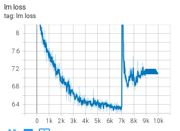
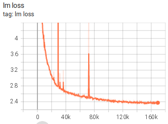
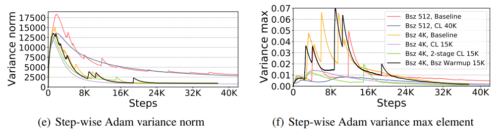
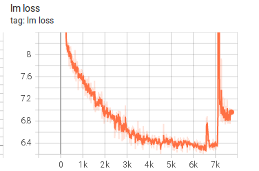
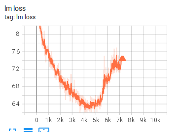

# tr8-104B Chronicles

Notes on the training progress with a particular focus on any encountered problems and their diagnosis and solutions/prevention.

To follow the training progress charts, see:  [tensorboard](https://huggingface.co/bigscience/tr8-104B-logs/tensorboard)

To follow the raw training logs see: [logs](https://huggingface.co/bigscience/tr8-104B-logs/tree/main/logs)

# Experiment 1

- Nodes: `64`
- Seed: `42`
- Started from iteration 0



Somewhere between iteration 7000 and 7010 lm loss jumped from 6.4 to 14 and then 200 iterations later it went down to ~7 and stayed there w/o any change, and later it went into NaN.

```
 iteration     7000/  159576 | consumed samples:       260912 | elapsed time per iteration (ms): 18706.1 | learning rate: 6.000E-05 | global batch size:    96 | lm loss: 6.444662E+00 | loss scale: 2048.0 | grad norm: 98258.265 | num zeros: 0.0 | number of skipped iterations:   0 | number of nan iterations:   0 |
------------------------------------------------------------------------------------------------
 validation loss at iteration 7000 | lm loss value: 7.174200E+00 | lm loss PPL: 1.305315E+03 |
------------------------------------------------------------------------------------------------
 iteration     7010/  159576 | consumed samples:       261872 | elapsed time per iteration (ms): 19904.0 | learning rate: 6.000E-05 | global batch size:    96 | lm loss: 1.142026E+01 | loss scale: 2048.0 | grad norm: 219645.978 | num zeros: 0.0 | number of skipped iterations:   0 | number of nan iterations:   0 |
 [...]
 iteration     7220/  159576 | consumed samples:       282032 | elapsed time per iteration (ms): 18333.4 | learning rate: 6.000E-05 | global batch size:    96 | lm loss: 7.155109E+00 | loss scale: 2048.0 | grad norm: 16921.991 | num zeros: 0.0 | number of skipped iterations:   0 | number of nan iterations:   0 |

```


Training more hasn't helped at all.

Solution:
- roll back to the last good checkpoint `global_step6210`
- change seed. New seed `43`.

Rollback:
1. checkpoints:
```
cd /gpfsscratch/rech/six/commun/checkpoints/tr8-104B/checkpoints
```

moved all checkpoints after `global_step6210` to another dir

fixed the `latest*` files to point to the checkpoint of our choice:

```
cat latest
perl -pi -e 's|\d+|6210|' latest*
```
check it's correct:
```
cat latest
cat latest_checkpointed_iteration.txt
```


2. couldn't leave tensorboard files from the unrolled section as is, so fixed tensorboard by first copying all the existing events log files to a new dir
```
cd /gpfsscratch/rech/six/commun/checkpoints/tr8-104B/tr8-104B-logs/tensorboard
mkdir tb-7k-glitch
cp events* tb-7k-glitch
git add tb-7k-glitch
git commit -m "saved the original tensorboard logs" tb-7k-glitch
git push
```
now checking the timestamp of the last checkpoint `global_step6210` we are rolling from and now manually removing all event log files from the main log whose timestamp is newer than the checkpoint `global_step6210`

now we have 2 tensorboards - the main running one and the one which we couldn't recover from - but we want it for posterity

Having a new seed forced regeneration of `.pny` files which re-randomized the order. If the glitch were due to faulty data this should have fixed the problem.

Started a new training from the last good checkpoint and it run until we run into a similar glitch even sooner.

# Experiment 2


- Nodes: `64`
- Seed: `43` (from the beginning)
- Restarted from `global_step6210`


Similar to glitch 1, but even sooner we went from 6.3 to 9 to 6.7


```
 iteration     6900/  159576 | consumed samples:       251312 | elapsed time per iteration (ms): 18495.6 | learning rate: 6.000E-05 | global batch size:    96 | lm loss: 6.365808E+00 | loss scale: 4096.0 | grad norm: 95313.572 | num zeros: 0.0 | number of skipped iterations:   0 | number of nan iterations:   0 |
 iteration     6910/  159576 | consumed samples:       252272 | elapsed time per iteration (ms): 18802.1 | learning rate: 6.000E-05 | global batch size:    96 | lm loss: 6.598378E+00 | loss scale: 4096.0 | grad norm: 84678.880 | num zeros: 0.0 | number of skipped iterations:   0 | number of nan iterations:   0 |
 iteration     6920/  159576 | consumed samples:       253232 | elapsed time per iteration (ms): 18641.0 | learning rate: 6.000E-05 | global batch size:    96 | lm loss: 7.314456E+00 | loss scale: 4096.0 | grad norm: 122716.232 | num zeros: 0.0 | number of skipped iterations:   0 | number of nan iterations:   0 |
 iteration     6930/  159576 | consumed samples:       254192 | elapsed time per iteration (ms): 18564.1 | learning rate: 6.000E-05 | global batch size:    96 | lm loss: 9.121927E+00 | loss scale: 4096.0 | grad norm: 283384.130 | num zeros: 0.0 | number of skipped iterations:   0 | number of nan iterations:   0 |
 iteration     6940/  159576 | consumed samples:       255152 | elapsed time per iteration (ms): 18549.7 | learning rate: 6.000E-05 | global batch size:    96 | lm loss: 1.023865E+01 | loss scale: 4096.0 | grad norm: 42359.376 | num zeros: 0.0 | number of skipped iterations:   0 | number of nan iterations:   0 |
```

Conglong Li made an interesting observation that in both cases the glitch happened very closely to the moment where LR warmup stopped, to quote:

> The gradients are the largest at the end of the LR ramp-up phase, so that's when there the training is the most unstable. There is no easy fix. Curriculum learning helps, and so does potentially lengthening warm-up/reducing the LR.
>
> We logged the L1 norm/max element of Adam optimizer's gradient variance, and found that 1) the norm and max element has a correlation with the LR schedule: they all reach max at/near LR peak 2) that is also where we have the highest risk of divergence.

Moreover, we reviewed the tr1-13B training and we had a huge glitch there from which it recovered, perhaps since the model was much smaller.



There the LR rampup stopped around 25k, and the first huge glitch occurred at around 29k iteration
https://huggingface.co/bigscience/tr1-13B-tensorboard/tensorboard
According to Conglong Li 25k and 29k are close enough based on their study. Quoting Conglong:

> In our study of [1.5B gpt-2](https://arxiv.org/pdf/2108.06084.pdf), we used 3K LR warmup and here you can see the grad variance norm (left) only reach bottom at 8K+ steps, and baseline's grad var max is unstable during first 10K+ steps:



So it looks that now we have 3 documented glitches that all are related to the end of the LR warm up end.

We are not yet excluding the case that something is wrong with the data. Going to look into it next.

After some more iterations this training went belly up in the same way via a second smaller glitch followed by loss going to NaN. Same as the first one just at a slightly different iteration.

Stopped this training.

So rolling back tensorboard and checkpoints again as described in the previous section

Also until we figure out the stability going to switch to a much more frequent checkpoint saving so it's much faster continue from the last good iteration. Let's try 300.
```
SAVE_INTERVAL=300
```


# Experiment 3

Corby Rosset suggested we try a more numerically stable self-attention version, which was implemented [here](https://github.com/bigscience-workshop/Megatron-DeepSpeed/pull/118)

Quoting:

Re: 104B instability (https://huggingface.slack.com/archives/C01NHER1JLS/p1632801340055000) One thing I've encountered before is how the self-attention is computed. E.g. this [line](https://github.com/bigscience-workshop/Megatron-DeepSpeed/blob/c839a8aa30731f71b3738d56009be9668508e366/megatron/model/transformer.py#L303) shows that the norm_factor may be multiplied after the Query * Key matrix multiplication. If the dim of Q and K are very large, the output may blow up and the norm_factor won't be able to save it.

Proposal: move the norm_factor inward, so Q and K are scaled down before matrix multiply:
```
matmul_result = torch.baddbmm(
            matmul_result,
            1.0/math.sqrt(self.norm_factor) * query_layer.transpose(0, 1),   # [b * np, sq, hn]
            1.0/math.sqrt(self.norm_factor) * key_layer.transpose(0, 1).transpose(1, 2),  # [b * np, hn, sk]
            beta=0.0 if alibi is None else 1.0, alpha=1.0)

        # change view to [b, np, sq, sk]
        attention_scores = matmul_result.view(*output_size)
```

To make the operation mathematically equivalent, moving the norm factor inward requires taking sqrt again
if n is a scalar, A and B matrices:
```
n * (A dot B) === (sqrt(n) * A) dot (sqrt(n) * B)
```

Also thanks to @RezaYazdaniAminabadi who helped to find where this function is defined in CuBlas https://docs.nvidia.com/cuda/cublas/index.html#cublas-GemmStridedBatchedEx and which includes the definition:

```
C+i*strideC=αop(A+i*strideA)op(B+i*strideB)+β(C+i*strideC), for i ∈[0,batchCount−1]
```
the issue is alpha is multiplied after the matrix-matrix mul is done so it can cause instability

- Repeated the same rollback to iteration 6210
- kept seed 43 (so the same data as experiment 2)

Also codecarbon has been ignoring the `log_level="error"` setting and bombarding the main log with thousands of warnings, which also indicate that it misses a lot of measurements, so turning it off as the measurements will be wrong anyway.

Experiment 3 failed in a very similar way as experiment 2




# Experiment 4

Iz Beltagy compiled a list of suggestions to try next. Quoting Iz:

A few thoughts and suggestions

The previous conversations are discussing two hypotheses for spikes and divergence.

* bad data: one easy way to test this hypothesis is to shuffle the data. Given that we tried this and it didn’t change much, I am less inclined to believe it is data. I also like to believe that these models are more robust to bad data than we are giving them credit. Maybe the model won’t learn anything useful, but at least it shouldn’t diverge
* it is fp16: this is possible and an easy way to test this hypothesis is to run everything on fp32. If it works, then we know it is fp16, so we go back and try to find the part of the network that is upsetting fp16 whether it is softmax, faulty implementation of selfattention, loss scale .. etc. But if we use fp32 and the model still diverges, then we don’t need to spend time exploring these tricks because we know they are not going to fix the problem

Let me add a few more hypotheses to the mix

* We are using beta2=0.999, while gpt3 used 0.95. My understanding is 0.95 is more stable but slower to train. I would try this as well given how easily and quickly the model is diverging

* Bad model design: prior work showed that the ratio between width and depth is important. That certainly matters for the loss but I don’t know how much it matters for the model stability. However, it is worth noting that this model is much much worse than the 13B model. After 6K steps it reaches loss=6.3 and the loss slowed down while the 13B model reached loss=4.5 and the loss is still sharply decreasing. This could be related; the model is not learning anything useful and thus easily diverging.

* Regarding the restarts, looking at the loss-scale curve, looks like the model was heading toward divergence long before 6Ksteps, maybe around 4.7Ksteps. If you restart, I would suggest going back to a checkpoint before 4.7K steps.

* Curriculum learning: it is a great idea, we tried it in a different project (but smaller models) and it works, but the model should train reasonably well without it. Using it now might mask a bigger underlying problem that we need to fix first

So to summarize, here are things to try
* if you still feel data could be the reason, try shuffling again but restart from step before 4.7K
* if it doesn’t work, disable fp16 and run everything in fp32 restarting from before step 4.7K
* if it doesn’t work, rerun from scratch with beta2=0.95 (I don’t have a good intuition if the model can recover with changing beta2 mid training, it might, I don’t know)
* if it doesn’t work, change model design to one with a reasonable ratio between depth/width

Samyam Rajbhandari seconded Iz's proposal:

I second @Iz Beltagy’s suggestion to use beta2=0.95. We have seen it stabilize very similar spiky loss in several cases.    My feeling is that it might be ok even without a full restart. But restarting early would be helpful. Depending on how long it takes, I feel like 6K, 4K and 3K would be good candidates to restart in an increasing order of preference.

So stopped the last experiment and started a new one - identical to Experiment 3, but:

- rolled back to iteration 3k - so earlier than 6210, as suggested that it might be too close to the blow up and we should try to make things better before that
- `--adam-beta2 0.95` - it should make the training slower but more stable


Rollback performed:

1. checkpoints:
```
cd /gpfsscratch/rech/six/commun/checkpoints/tr8-104B/checkpoints
```

moved all checkpoints after `global_step3000` to another dir

fixed the `latest*` files to point to the checkpoint of our choice:

```
cat latest
perl -pi -e 's|\d+|3000|' latest*
```
check it's correct:
```
cat latest
cat latest_checkpointed_iteration.txt
```

2. tensorboard, similar to the previous tries.




It went in the wrong direction around iteration 5k - stopped this experiment.


# Experiment 5

Same as Experiment 4, but rolling back to iteration 0.


It trained faster but still went in the wrong direction around iteration 5k - stopped this experiment.


# Experiment 6

Discovered a really bad mistake in the setup that impacted all the previous experiments that failed.
 When changing from 13B to 104B I did not update `FFN_HIDDEN_SIZE` and it remained `20480` when it should have become `65536`, so it has been a very lopsided 58B model instead of 104B all along.

Lesson learned: I'm going to change the slurm script to not explicitly set `FFN_HIDDEN_SIZE` and let Megatron automatically set `FFN_HIDDEN_SIZE = 4 * HIDDEN_SIZE` to avoid similar errors in the future.

Additionally, because `FFN_HIDDEN_SIZE` was so small, the fixed setup required re-tune up of the training setup - as a lot more nodes are now required.

So let's look at the math:

```
# Let h = hidden size, n = num_layers, k = num_heads, s = sequence length, v = vocabulary size
total_params = n * (12h^2 + 13h) + (v * h) + (s * h) + 2*h
```

the correct 104B is:
- 0.8x times layers=32 than 13B (40)
- 3.2x times NHIDDEN=16384 than 13B (5120)

While the 104B model is 8x times bigger than 13B param-wise, the model grows quadratically with NHIDDEN size, so each layer will require ~10x (3.2**2) more gpu memory plus more memory per activations. We double TP from 2 to 4 as 4 is a max we can use on a 4-gpu node. So we have to 5x the PP then, so we need at least PP=20, and to work with NLAYERS=32, it takes us to PP=32.

So the needed config is:
```
TP_SIZE=4
PP_SIZE=32
```

so 13B took 8 gpus for a single replica, and 104B needs 128 gpus (16x times)

I also switcheed to `--rampup-batch-size 32 32 6_000_000`, because of PP=32 (but that wasn't needed since it's the number of replicas that matters. there needs to be enough batch size to go over replicas, so `BS>n_replicas` and `BS` has to be divisible by `n_replicas`. Corrected this in the following experiment.)

I'm going to repeat Experiment 5 with :

- fixed `FFN_HIDDEN_SIZE` (so that it's `4 * HIDDEN_SIZE`)
-  `--rampup-batch-size 32 32 6_000_000`

And the outcome is very similar to Exp 4 and 5 despite the corrected model shape:


# Future Experiments

1. if it doesn’t work, change model design to one with a reasonable ratio between depth/width - currently it's 512. Try 256? (going for the opposite of very deep and shallow won't be learning much)

2. get back to beta2=0.999 (with spikes) and try fp32. If Corby’s self-attn version made a difference, then maybe it is an fp16 instability issue.
   note: This will require approximately 30% more RAM for activation memory - so to run this experiment we have to first test that we can fit it.
```
perl -pi -e 's|--adam-beta2 0.95|--adam-beta2 0.95|' *slurm
```

3. try lower learning rate (half the LR and longer warmup) - ideally wait for CongLong
   - try lower target learning rate 2.5e-5 - longer ramp up - past 10k iterations (Samyam)
   - max lr the same - twice as long ramp up, half as long, (Stella)
   - Curriculum Learning should fix all these lr-related problem (waiting for CL implementation)

4. reduce SEQLEN 1024K? 512?

5. Switch to LAMB? But we haven't discussed that in details.

6. Change number of HEADS to 80 to go along similar setup, even though some research suggests that it doesn't matter much https://blog.ml.cmu.edu/2020/03/20/are-sixteen-heads-really-better-than-one/

# Experiment 7

Same as Exp 6 with the following changes:

1. Trying width/depth ration of 180 instead of 512. Which puts it into a normal range and it's no longer an unusually wide model (in the megatron's paper the ratio grows from 150 to 200 as the model grows)

```
NLAYERS=64
NHIDDEN=11600
NHEADS=40
```


```
perl -pi -e 's|NHIDDEN=16384|NHIDDEN=11600|' *slurm
perl -pi -e 's|NLAYERS=32|NLAYERS=64|' *slurm
perl -pi -e 's|NHEADS=32|NHEADS=40|' *slurm
```

Note: this should use less gpu memory too, but if it's another short experiment there is no need to re-tune the training setup.

We don't know whether it was a good idea to change `NHEADS` - it doesn't change the model size, and there is [research](https://blog.ml.cmu.edu/2020/03/20/are-sixteen-heads-really-better-than-one/) that shows that nheads doesn't quite matter. We could have kept `NHEADS=32` and used `NHIDDEN=11616` to keep the model of the same size (tiny change). The two have to respect`NHIDDEN % NHEADS = 0` rule.

2. reverted back to `--rampup-batch-size 16 16 6_000_000`. We were fine with BS increments of 16 since we can't fit too many replicas anyway. Since currently each replica is 32 nodes, with 64 or 128 nodes we will be using only 2 or 4 replicas, therefore no problem to run BS=16 increments.


XXX: to be continued

stopped at Date: 2021-10-05
