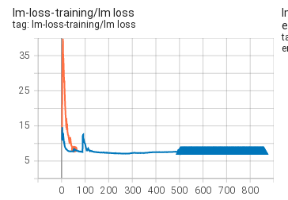

# Chronicles

Same as tr8-104B but using Curriculum Learning (CL)

https://huggingface.co/bigscience/tr8b-104B-logs/tensorboard

# Experiment 1

Trying to figure out good baseline settings for CL

[baseline script](
https://github.com/bigscience-workshop/bigscience/blob/82fe642fb1eedd0361bac6899b79769e2c842c9f/train/tr8b-104B/tr8b-104B-cl.slurm)

Stopped training at iter 500:




# Experiment 2

Need to finetune for more optimal performance

> Conglong Li

Here are my recommendation for next time: GPT-3 uses 375M token for LR warmup. Assuming the average seqlen is about 100 during LR warmup for CL (a very rough estimation), then we should set LR_WARMUP_SAMPLES= 375e6/100 = 3_750_000, this leads to 375e6/100/2048 = 1.8K warmup steps which sounds good to me

For peak LR, yeah 1e-4 might be a good next candidate, together with LR_WARMUP_SAMPLES=3_750_000

GPT-3 175B uses 6e-5 for batch size 1.6K, so 1e-4 for batch size 2K seems to be an appropriate/moderate increase.

Also change eval from every 1k to 150, since we can't tell from lm loss what's going on - we need the eval loss as it is reported for the full SEQLEN (whereas train lm loss just for the current CL SEQLEN instead).
150 since that's the current period between switching seqlen.

```
perl -pi -e 's|--lr 6e-5|--lr 1e-4|' *slurm
perl -pi -e 's|LR_WARMUP_SAMPLES=216_320|LR_WARMUP_SAMPLES=3_750_000|' *slurm
perl -pi -e 's|--eval-interval 1000|--eval-interval 150|' *slurm
```

[script](https://github.com/bigscience-workshop/bigscience/blob/d5fc4b22d7e88e87b4b9ec610b6c522b9a8c7a8d/train/tr8b-104B/tr8b-104B-cl.slurm)
